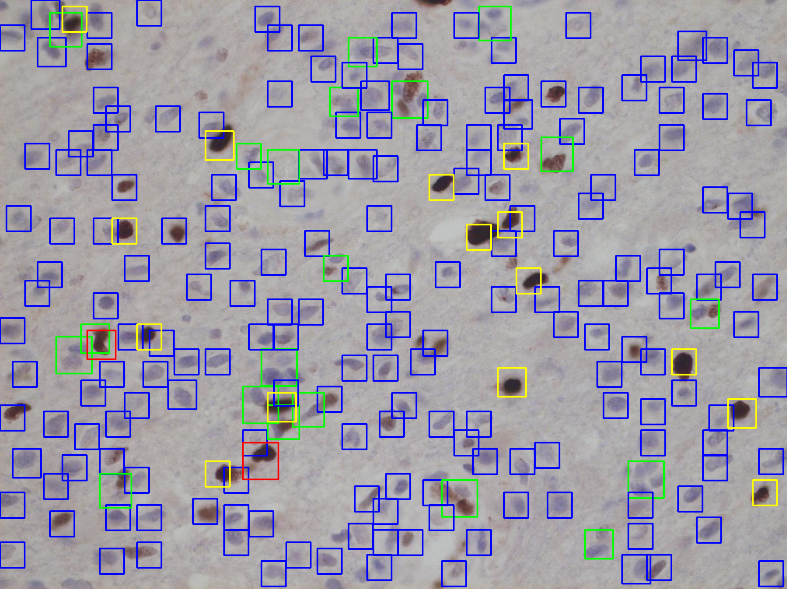

# Detection of proliferation indices from microscopic image for tumour progression analysis
In the study, we design an algorithm based on the residual netork, sliding window and softer non-maximum suppression for Glioblastoma (GBM) detection in microscopy images. To get more details about our work, please go to this link: [UROS 2020](https://lalt.lincoln.ac.uk/portfolio/uros-2020-project-detection-of-proliferation-indices-from-microscopic-image-for-tumour-progression-analysis/)

## Example of Evaluation

## Evaluation Results
| Test Image (No.)| Avg. Precision  | Avg. Recall  | Avg. F1-Score |
|  ----  |  ----  | ----  | ----  |
| Test Image1  | 0.93 | 0.78 | 0.83 |
| Test Image2  | 0.91 | 0.90 | 0.91 |
| Test Image3  | 0.91 | 0.88 | 0.89 |

## Reference
1. He, K., Zhang, X., Ren, S. and Sun, J., 2016. Deep residual learning for image recognition. In Proceedings of the IEEE conference on computer vision and pattern recognition (pp. 770-778).
2. He, Y., Zhang, X., Savvides, M. and Kitani, K., 2018. Softer-nms: Rethinking bounding box regression for accurate object detection. arXiv preprint arXiv:1809.08545, 2.
